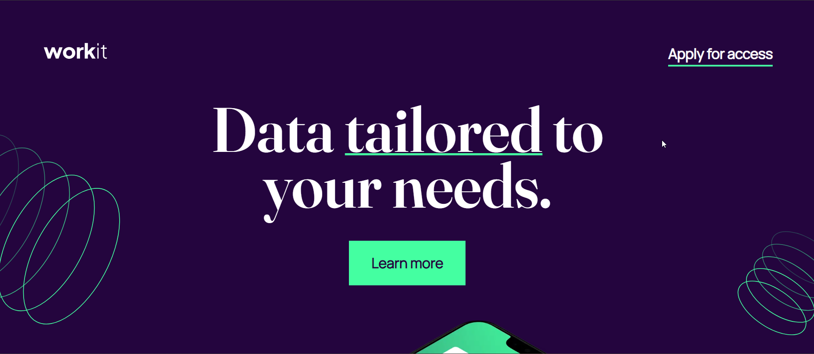

# Frontend Mentor - Workit landing page solution

This is a solution to the [Workit landing page challenge on Frontend Mentor](https://www.frontendmentor.io/challenges/workit-landing-page-2fYnyle5lu). Frontend Mentor challenges help you improve your coding skills by building realistic projects.

## Table of contents

- [Overview](#overview)
  - [The challenge](#the-challenge)
  - [Screenshot](#screenshot)
  - [Links](#links)
- [My process](#my-process)
  - [Built with](#built-with)
  - [What I learned](#what-i-learned)
  - [Continued development](#continued-development)
  - [Useful resources](#useful-resources)
- [Author](#author)
- [Acknowledgments](#acknowledgments)

## Overview

### The challenge

Users should be able to:

- View the optimal layout for the interface depending on their device's screen size
- See hover and focus states for all interactive elements on the page

### Screenshot

### Links

- Solution URL: [Solution](https://github.com/Shahbaaz92/Workit-landing-pages)
- Live Site URL: [Workit landing page](https://shahbaaz92.github.io/Workit-landing-pages/)

## My process

### Built with

- Semantic HTML5 markup
- CSS custom properties
- Flexbox
- [React](https://reactjs.org/) - JS library

### What I learned

I learned creating react js websites and deploying them in github.
I learnt importing of images from source folder.
Creating seperate components.
Though this project did not require javascript i used it to create components.
I am proud of this component.
/\*
const articles = [
{
id: 1,
number: 1,
title: "Actionable insights",
about:
"Optimize your products, improve customer satisfaction and stay ahead of the competition with our product data analytics.",
},
{
id: 2,
number: 2,
title: "Data-driven decisions",
about:
"Make data-driven decisions with our product data analytics. Our AI-generated reports help you unlock insights hidden in your product data.",
},
{
id: 3,
number: 3,
title: "Always affordable",
about:
"Always affordable pricing that scales with your business Get top-quality product data analytics services without hidden costs or unexpected fees.",
},
];

function Article(props) {
const { number, title, about } = props;
return (

<article className="article">

{number}

<h3 className="pro-title">{title}</h3>

{about}

</article>
);
}
\*/

### Continued development

I will keep on increasing my react skills with continued development.

### Useful resources

- [Deploying react app](https://www.youtube.com/watch?v=Q9n2mLqXFpU&t=523s) - This video helped me for deploying react app and publishing it. I was stuck for long time to just deploy.

## Author

- Frontend Mentor - [@Shahbaaz92](https://www.frontendmentor.io/profile/Shahbaaz92)
